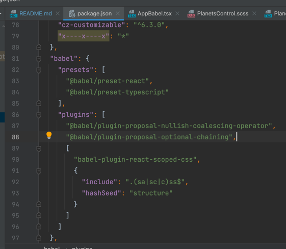
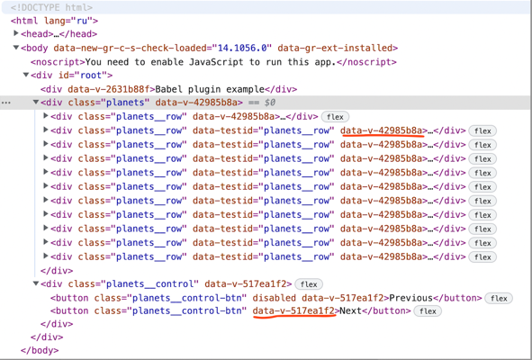

# This project uses the Babel plugin 

The main idea is to set up Webpack so that the project was a classical web application, without any changes in development. It is used pattern SCSS with mixins and variables + TSX.

https://www.npmjs.com/package/babel-plugin-react-scoped-css

The plugin `babel-plugin-react-scoped-css` added in config in `package.json`

and included `scoped-css-loader` in webpack.config.

Starting the project and looking at the DOM, it is noticed that each react component has its unique data attribute.

The issue is solved CSS will be encapsulated inside a react component.

###Themes and styles
there are two types of files `global` and `local`

The format of global files is `.global.scss`. All styles there works with interceptions as usual scss.
Classes in global scope could be sent to child component.

The format of local files is `*.scss`. All styles there encapsulated in their React components.
Intersections are impossible due to hash data attribute.

We can add `[data-theme="***"]` to any tag to get efffect from the theme.

Benefits
* classical approach
* fast work
* the easiest way of encapsulation

Drawbacks 
* we should remember that if we write classes outside the component they will be ignored
* issues with classes as a part of props
* a little bit slower than CSS because of more complicated selectors( they are formed automatically by Babel)
