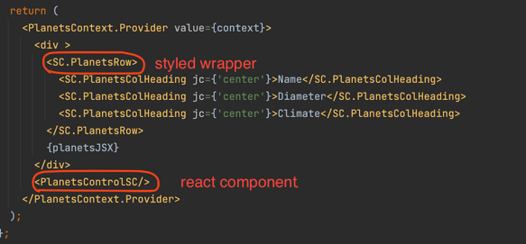
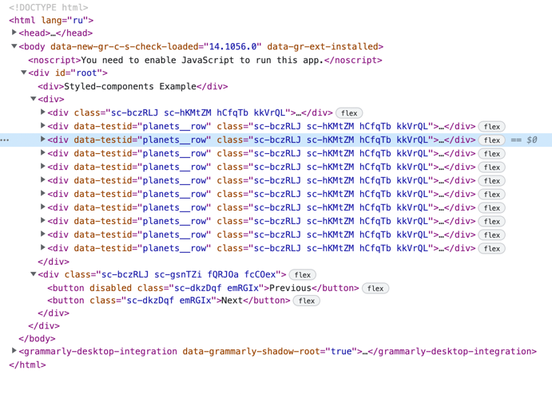

# This project uses styled components

The main idea is to set up the project so that excludes CSS files. Styles are formed as part of TS and added as separate files in DOM during the work of the application.

This project used an approach that separates TSX and style files.Using that it is possible to distinguish what is a styled wrapper and what is a react component.

Results:

###Themes
Native Theme Provider is used. 

Benefits

* fewer files in the final build
* easier work with props and parameters
* it isn't necessary to learn and use css mixins
* All variables in the theme are strictly typed

Drawbacks

* each developer should get used to that
* the slowest way of encapsulation
* it makes code more complicated
* it makes DOM styles unreadable without additional plugins
