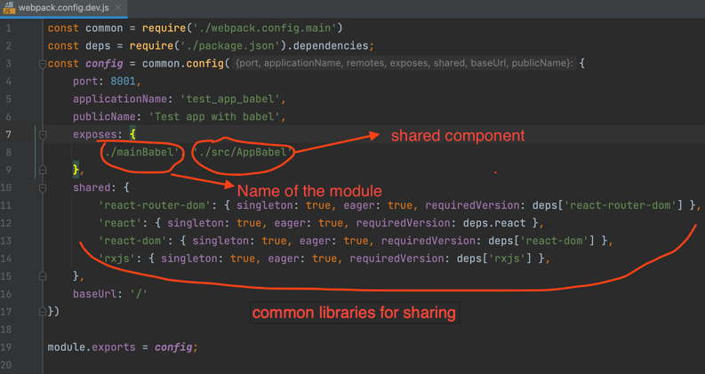
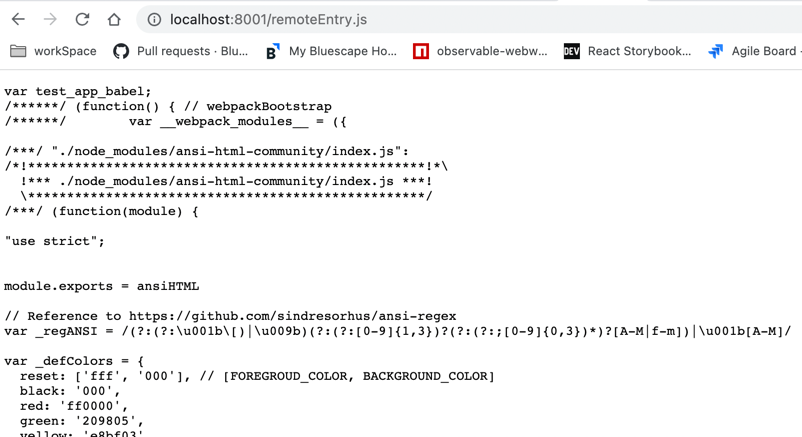
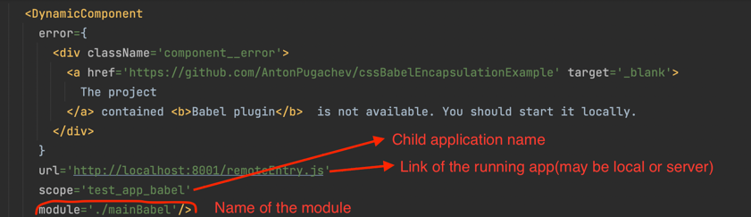
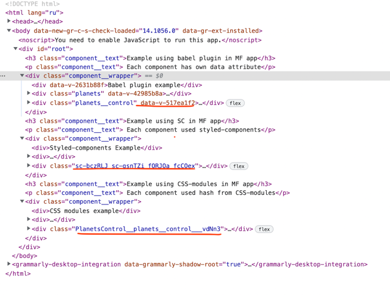

# This project uses a micro frontend to unify several projects

https://webpack.js.org/concepts/module-federation/

Each child project should be configured as a module

Each project contains `remoteEntry.js` path where it is started

Next step is add DynamicComponent in the project

It is necessary to run all projects using `yarn start` in each of them.

Finally, we can start this project.
All css  encapsulation approaches in the one project 

