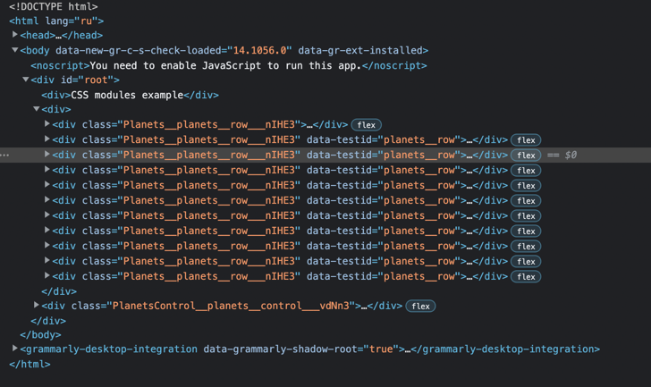

# This project uses css modules

Benefits
* the fasted approach

Drawbacks
* classes can't use `-` inside without libraries
* code is worse readable
* we should use external libraries to combine several classes
